# Zygisk注入器 - 动动手指轻松注入并隐藏你的SO文件

## 前言

作者在去年发布了[Zygisk注入模块的实现](https://bbs.kanxue.com/thread-283790.htm)，成功实现了模块的自动注入和Riru隐藏功能。

然而，每次更换目标应用都需要重新编译，操作繁琐，导致用户采用率不高。为了解决这个问题，作者对项目进行了全面重构，带来了以下改进：

- **图形化界面**：告别命令行，操作更直观
- **一键安装**：面具模块快速部署
- **配套管理APP**：轻松管理注入配置

项目已完全开源，包含面具模块、管理APP以及所有打包脚本，并配置了GitHub CI自动构建。欢迎各位开发者贡献代码，提交PR。

### 版本规划&更新记录
版本规划:
- **v1.x**：专注功能添加，暂不考虑反检测
- **v2.x**：实现各种检测绕过，达到100%无痕注入
  
更新记录:
- **v1.2**: 增加gadget配置的自动生成，支持脚本和server模式，解决了若干bug，增加了全局注入延迟设置

## 致谢
**项目地址**：[https://github.com/jiqiu2022/Zygisk-MyInjector](https://github.com/jiqiu2022/Zygisk-MyInjector)

特别感谢以下项目和开发者（按时间顺序）：

- [Zygisk-Il2CppDumper](https://github.com/Perfare/Zygisk-Il2CppDumper) - 提供最原始的注入思路
- Riru - 提供隐藏思路
- 小佳大佬 - 提供App界面化的思路
- [soLoader](https://github.com/SoyBeanMilkx/soLoader) - 提供自定义linker注入的全部逻辑，期待认识作者和作者一起继续完善

如果对自定义linker感兴趣的大佬，推荐soLoader作者的文章https://yuuki.cool/2025/06/15/CustomLinker/

## 使用教程

### 步骤一：下载并安装面具模块

1. 前往 [GitHub Release](https://github.com/jiqiu2022/Zygisk-MyInjector/tags) 页面下载最新版本的面具模块
   
   本教程以 [v1.1.0](https://github.com/jiqiu2022/Zygisk-MyInjector/releases/tag/v1.1.0) 版本为例

2. 下载模块文件（如下图所示）：

   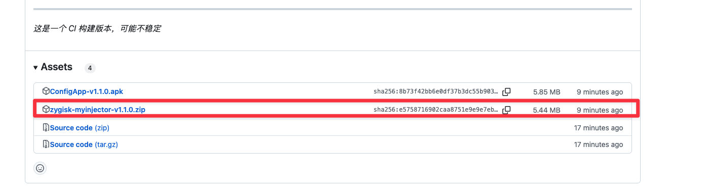

3. 安装到手机，支持所有面具模块相关的APP（如 KernelSU、APatch 等）

> **注意**：如果您的APP不支持Zygisk注入，请额外安装 Zygisk-Next 模块，否则可能导致注入失败。

### 步骤二：准备SO文件并配置

#### 1. 添加SO文件

进入"SO文件管理"，点击"增加SO文件"：

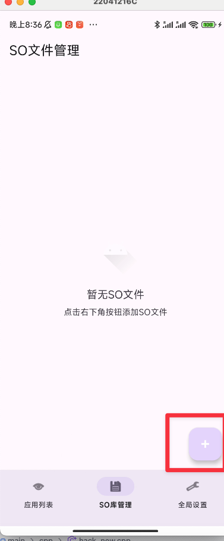

选择要注入的SO文件：


本教程使用以下两个SO文件进行测试：
- `libmylib.so`（全注入测试）
- `libgadget.so`（普通注入方式）

> **提示**：后文将解释为什么自定义linker无法注入 `libgadget.so`。

#### 2. 处理原文件

选择SO后，系统会询问是否删除原文件：

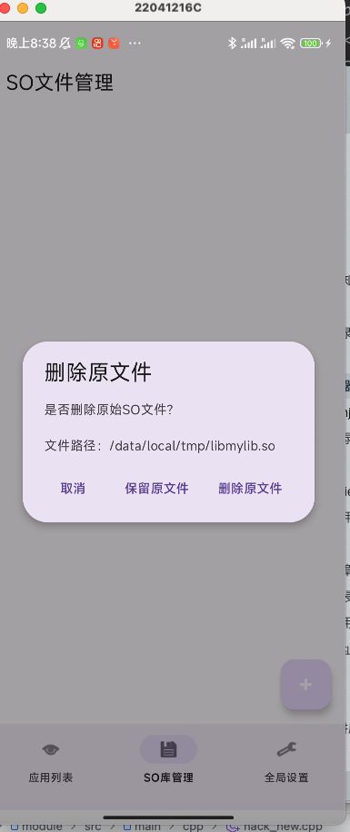

> **设计理念**：此功能可防止某些APP扫描tmp目录中的SO文件进行风控检测。

添加成功后，SO管理界面会显示已添加的文件：

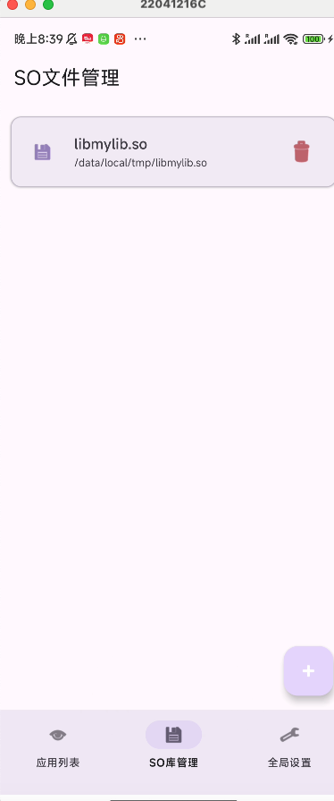

### 步骤三：配置目标APP

本教程以珍惜大佬的Hunter为例演示配置过程。

1. 点击空白处，配置注入参数：

   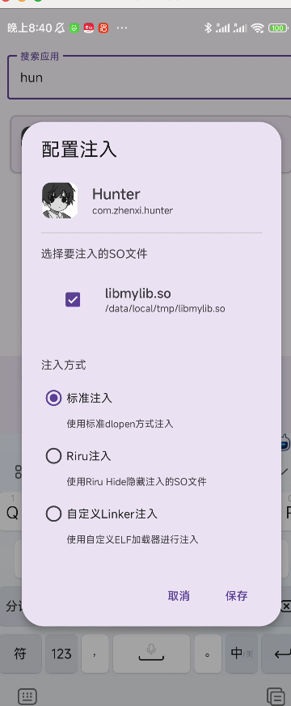

2. 保存配置后，开启注入开关：

   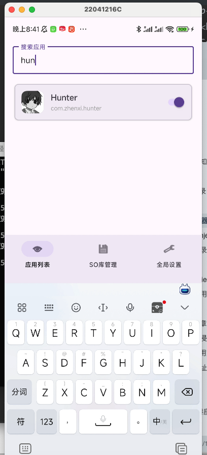

### 步骤四：验证注入效果

打开目标APP，查看日志输出：

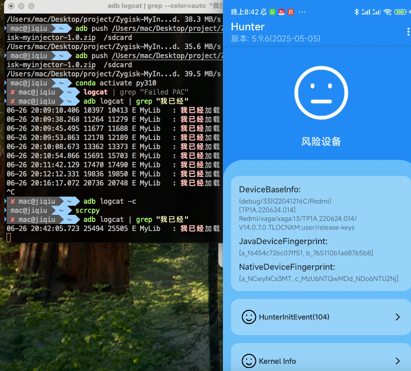

成功打印"我已经成功加载"，表明注入成功。

#### 测试Gadget注入

切换到gadget进行测试：

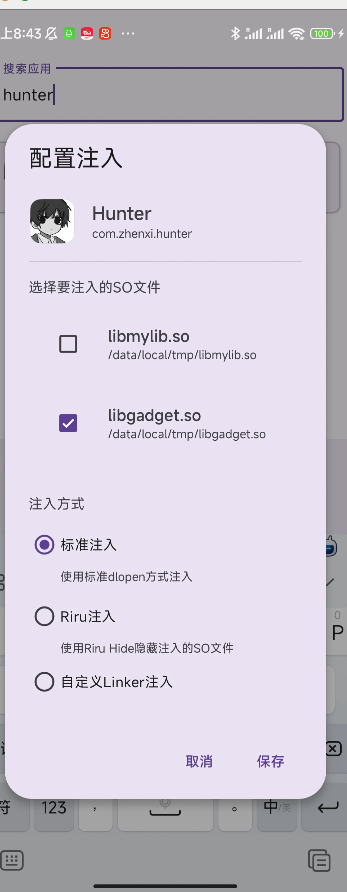

> **特性**：本注入模块支持同时注入多个SO文件。

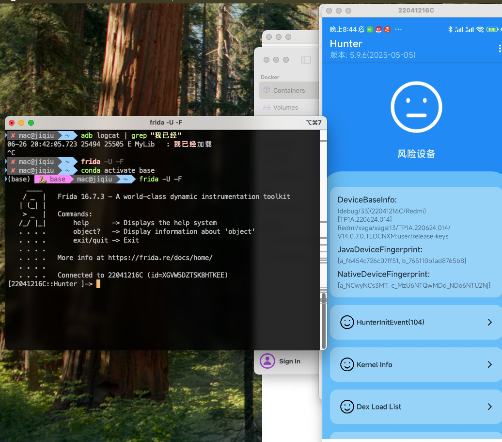

注入成功：

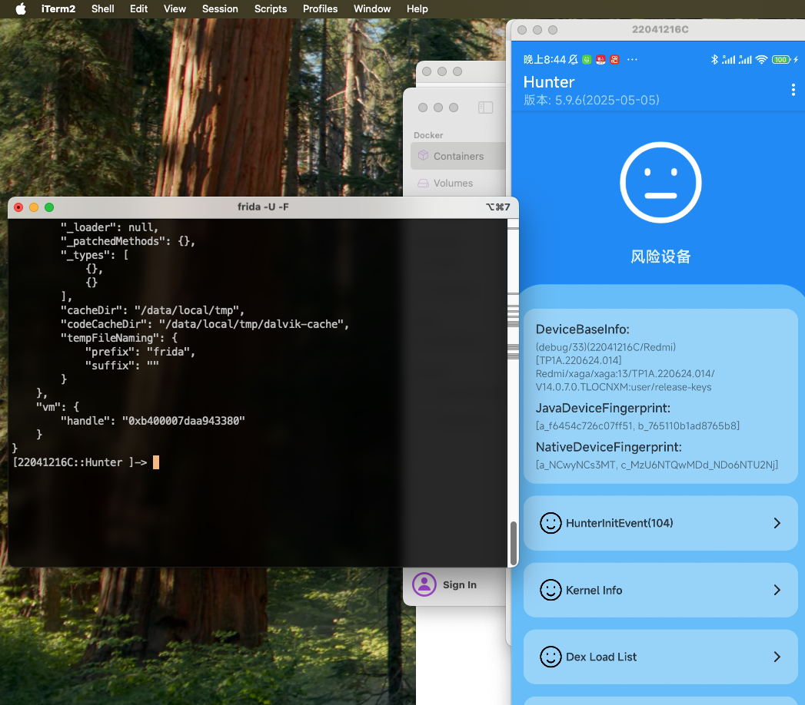

> **说明**：由于使用的Hunter版本较旧，可能无法检测到注入。建议使用新版本进行测试。

#### 测试其他注入方式

测试Riru Hide功能：

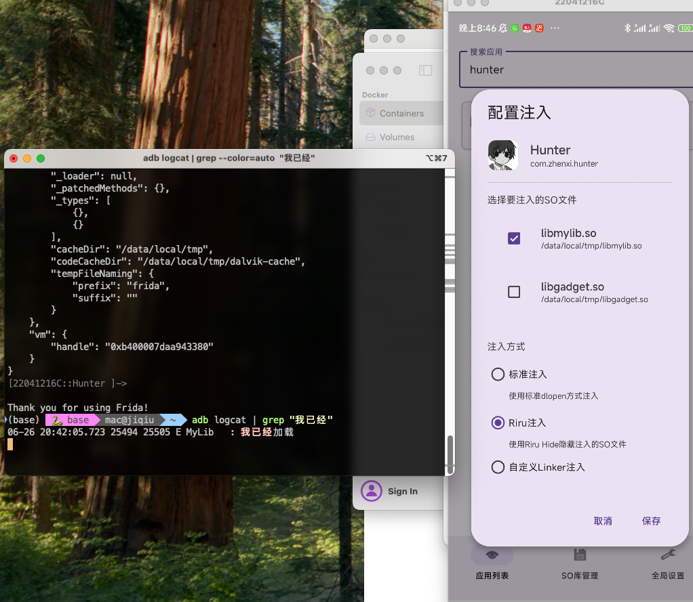

> **提示**：修改配置后，建议先关闭再开启注入开关，确保新配置生效。

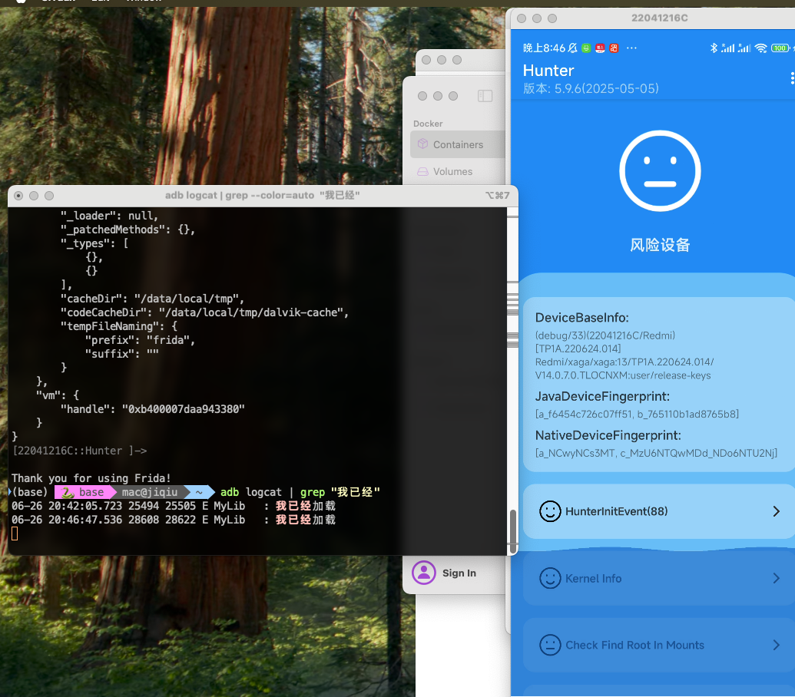

Riru Hide成功生效。

测试自定义Linker加载：

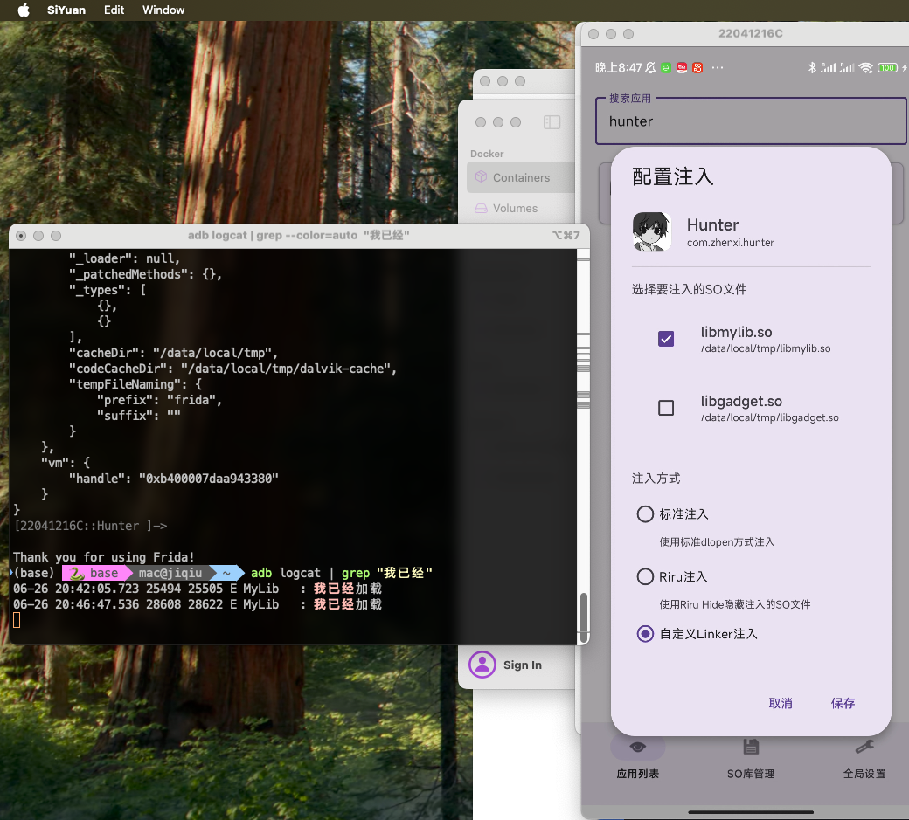

加载成功：

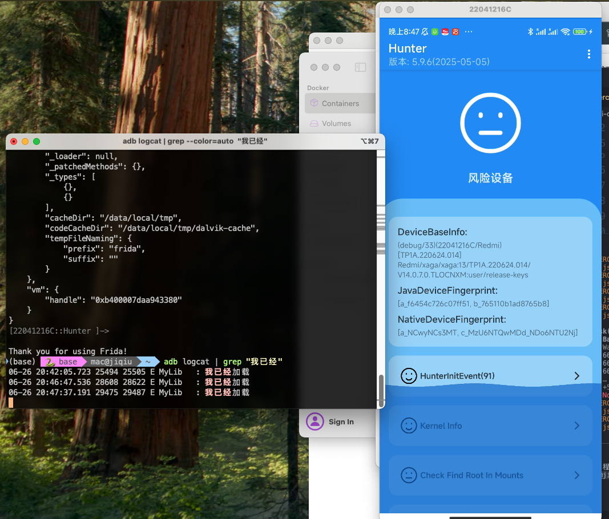

## 编译指南

### 自动编译

参考项目中的 [CI配置文件](https://github.com/jiqiu2022/Zygisk-MyInjector/blob/main/.github/workflows/ci.yml)。

如果您fork了本项目，只需在本地修改代码并push，云端将自动编译。

### 本地编译

使用项目提供的 `build_all.sh` 脚本进行编译。

> **环境要求**：需要Java 17环境。

## 工作原理

### 注入流程详解

1. **SO文件管理**
   - 用户选择SO文件后，APP自动将其复制到 `/data/adb/modules/module-name` 目录下进行统一管理
2. **配置生成**
   - 完成APP配置后，管理器在 `/data/adb/modules/module-name` 下创建config文件
   - 面具模块启动时读取此配置，执行SO加载
3. **注入激活**
   - 开启注入时：APP将管理器中的SO复制到目标APP目录，并将config状态设置为开启
   - 关闭注入时：APP自动删除已复制的SO文件，将config状态设置为关闭
## 为什么自定义linker不能注入gadget

```
frida_KjnwyG_detect_location: assertion failed: (our_range != null)
Bail out! Frida:ERROR:../lib/KjnwyG/KjnwyG.vala:809:frida_KjnwyG_detect_location: assertion failed: (our_range != null)
Aborted
```

因为gadget的init_array里面其中有一个函数，尝试使用maps和soinfo获取到自己模块的信息，防止递归调用。

但是自定义linker的soinfo和内存段都是自己分配的，导致gadget找不到自己，发生了断言失败，我们可以简单的去掉断言，但是可能造成其他bug，后续作者会和小佳一起修复。

当然还有一种复杂的方法，就是用注入的so的soinfo，替换成要注入的so的，多见于360等壳子，等后续作者会实现。


## 后续更新计划

- **深度隐藏**：联动内核模块，提供maps等更深层次的隐藏功能
- **用户体验优化**：
  - 增加gadget配置一键生成功能
  - 提供更友好的界面交互
  - 支持批量配置管理

---

欢迎关注项目进展，期待您的贡献！
